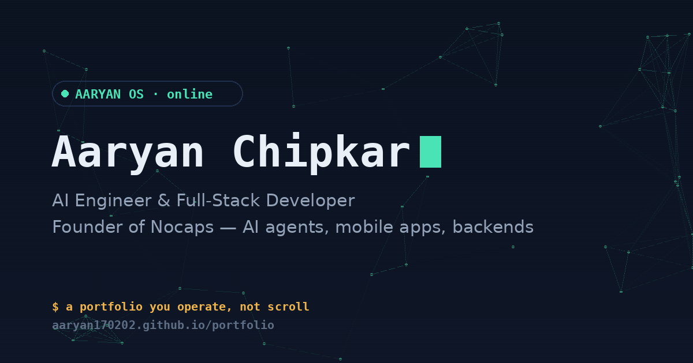

<div align="center">



### a portfolio you operate, not scroll

**[aaryan170202.github.io/portfolio →](https://aaryan170202.github.io/portfolio/)**

</div>

<br>

## What this is

Most portfolios are a page you scroll past. This one is a desktop you boot into.

**AARYAN OS** is a fictional operating system that runs entirely in the browser — icons you drag around, windows you open and close, a terminal that actually executes commands, and a small arcade of games I built from scratch. Under the hood it's my résumé; on screen it's a product. That's deliberate: I build interactive software for a living, so my portfolio does too.

No React, no build step, no dependencies. Three files, zero frameworks, one philosophy — the medium should match the message.

<br>

## ✦ Features

**The desktop**
- Draggable icons — rearrange them anywhere, your layout is remembered on return visits
- Windows you open, drag, minimize, and close like a real OS
- An **App Store** — uninstall apps you don't care about, reinstall them anytime
- A permanent on-screen game controller (D-pad + A/B) as a second way to navigate, alongside touch and keyboard — physical gamepads work too, via the Gamepad API

**The apps**
| App | What it does |
|---|---|
| `Start Here` | The orientation guide — how the OS works |
| `About Me` | Who I am, in plain terms |
| `Experience` | What I've shipped, at TCS and independently |
| `Skills` | The stack, grouped and honest |
| `Services` | What I can build for you |
| `Projects` | Nocaps and selected work |
| `Terminal` | A real shell — try `help` |
| `Arcade` | Three original games (below) |
| `App Store` | Install / uninstall any app |
| `Contact Me` | A working form, and an email that's one tap away |

**The arcade** — three small games, each themed around the work itself:
- 🐛 **Squash Bugs** — debug reflexes against a 20-second clock
- 🧠 **Stack Match** — memory game where the pairs are my actual tech stack
- ⌨️ **Type Speed** — how fast can you type real dev commands, exactly

**The side quest** — explore naturally and AMORE NET (a nod to my product, Nocaps) quietly tracks 10 behavioral signals in the corner. Complete them all and it prints a visitor × Aaryan "compatibility report," confetti included. Entirely optional, entirely for fun.

<br>

## ✦ Stack

```
HTML · CSS · Vanilla JavaScript
```

No framework, no bundler, no `node_modules`. Every animation, drag interaction, and the terminal's command parser is hand-written. This was a choice, not a limitation — a portfolio is a handful of static views with some client-side behavior, not an app that needs a component tree. Vanilla JS also means it loads instantly and will still run correctly in ten years.

<br>

## ✦ Project structure

```
portfolio/
├── index.html   → structure & content
├── styles.css   → every visual (~400 lines)
├── app.js       → all behavior: windows, terminal, games, drag, controller
└── og.png       → social preview image
```

No build step. Open `index.html` in a browser and it runs exactly as deployed.

<br>

## ✦ Run it locally

```bash
git clone https://github.com/Aaryan170202/portfolio.git
cd portfolio
# then just open index.html — or, for a local server:
python3 -m http.server 8000
```

<br>

## ✦ A few things worth finding

The terminal takes real commands. The desktop has a Konami code. There's a compatibility report waiting at the end of the side quest. I'll leave the rest for you to find.

<br>

## ✦ About me

I'm an AI Engineer & Full-Stack Developer, currently building enterprise systems and shipping [**Nocaps**](https://www.nocaps.in) — an AI-native compatibility platform — as founder.

<div align="left">

📧 [aaryanchipkar17@gmail.com](mailto:aaryanchipkar17@gmail.com) · 💼 [LinkedIn](https://www.linkedin.com/in/aaryanchipkar) · 🐙 [GitHub](https://github.com/Aaryan170202) · 🚀 [Nocaps](https://www.nocaps.in)

</div>

<br>

<div align="center">

*if you made it this far — [open Contact Me](https://aaryan170202.github.io/portfolio/) and let's build something.*

</div>
